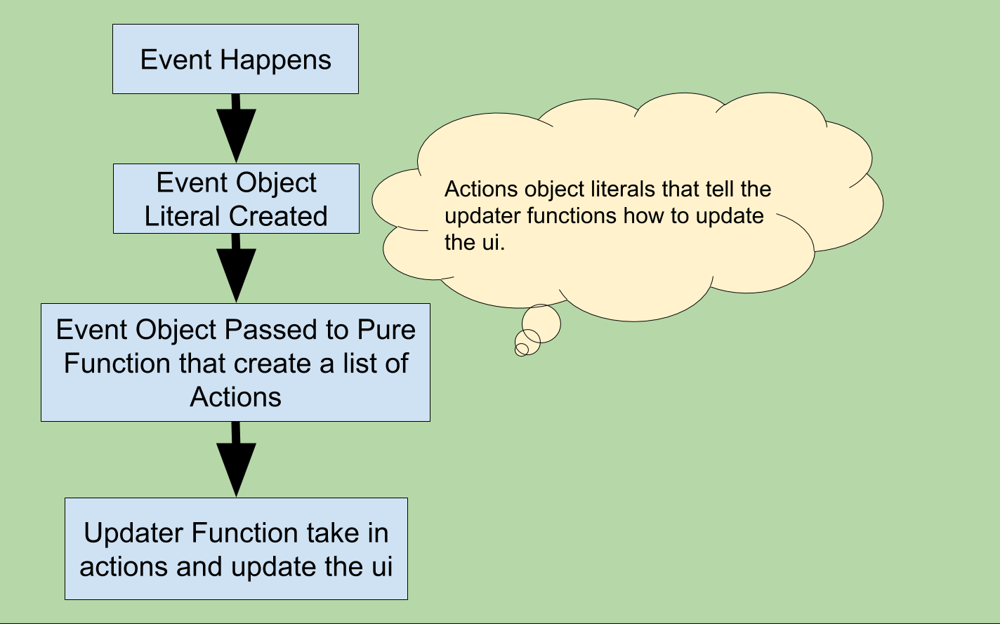

# Architecture

Core Ideas

- Objects / Data should live separately from things that manipulate data. In
  other words objects should not have methods. They should be kept plain.
  - Separates out concerns. It's easier to think of functions maninpulating
    data.
  - Prevents complex ideas like dependency injection. If all the your services
    are singletons that don't store state there is no adavance to classes.
  - Allows for no mock tests. These are tests that don't try follow the
    implementation of the code. It's easier to do stuff like TTD when you are
    testing inputs and outputs.
- We don't use complex function based language in the code. Please do not
  mention things like monad, they confuse me and a lot of other people. Instead
  we use easy to understand high value terms. Like immunitablity, and pure
  functions which are easy to explain.

- Functions should be pure whenever possible
  - Pure functions are things that don't affect things that live outside themselves and return a single value.
  - Pure functions are used to tell other functions how to update the state.
  - All rule based logic should go into pure functions.
  - Examples:
    - Dupicate Pin Logic
    - Disabling duplicate setup blocks
- Interfaces heavily used
  - Interface function allow hash table functions which I believe will allow 3rd party modules in the future.

## How things are updated

The idea that the business logic, aka the what happens can be easily tested in the pure functions.  While the how it happens is done in the updater and will be tested with end to end tests later on.

